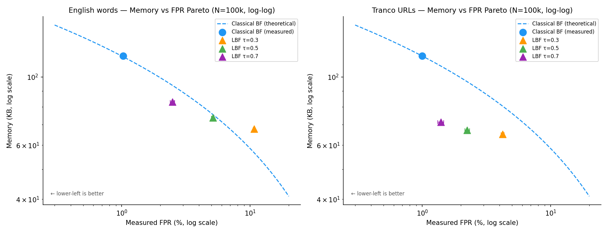
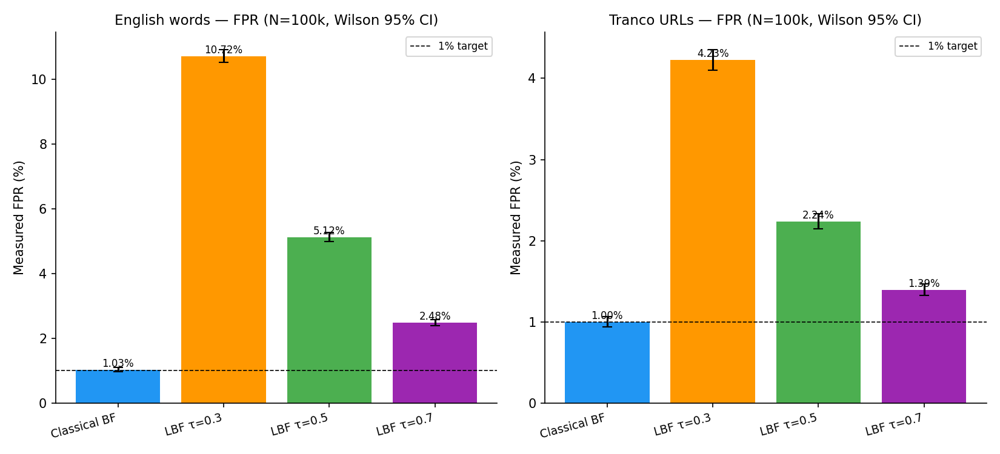
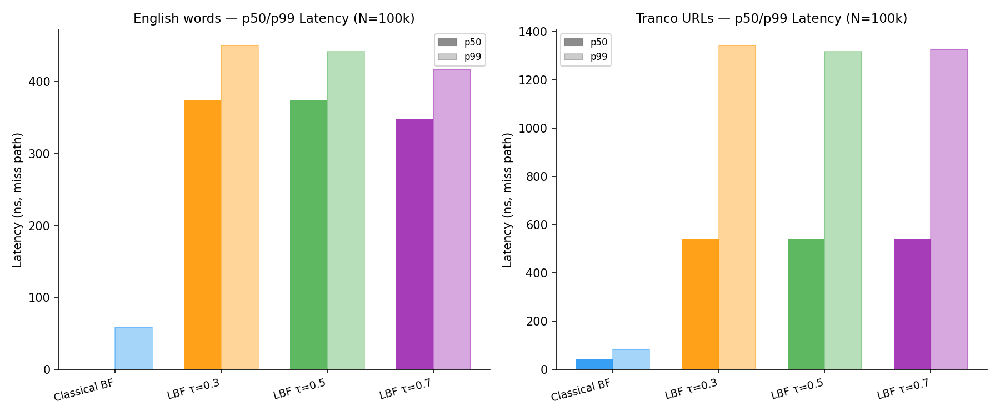

# Bloom Filter — Classical and Learned

A C++20 implementation of a classical Bloom filter alongside a **Learned Bloom
Filter** (Kraska et al., "The Case for Learned Index Structures", 2018).
The LBF replaces a fraction of the classical filter with a trained model:
the model fast-paths likely-negative queries, and a small backup Bloom filter
guarantees zero false negatives for members the model misclassifies.

The repository includes a complete benchmark suite measuring false-positive
rate, memory, and latency across three datasets and comparing both filter
types head-to-head.

---

## Contents

- [How It Works](#how-it-works)
- [Results at a Glance](#results-at-a-glance)
- [When to Use LBF](#when-to-use-lbf)
- [Approach and Implementation](#approach-and-implementation)
- [Methodology](#methodology)
- [Future Work](#future-work)
- [Building and Running](#building-and-running)
- [Repository Structure](#repository-structure)
- [Retraction Notice](#retraction-notice)

---

## How It Works

### Classical Bloom Filter

A bit array of `m` bits with `k` independent hash functions. For each member
inserted, `k` bits are set. A query returns `true` if all `k` bits are set.
False negatives are impossible; false positives occur at rate
`p ≈ (1 − e^(−kn/m))^k`, minimised at `k = m/n × ln 2`.

Memory scales as `m = N × ln(1/p) / ln(2)²` bits — purely a function of set
size and target FPR. The structure has no notion of the data's content.

### Learned Bloom Filter

The LBF exploits **content structure** to reduce memory:

```
Query key k
    │
    ▼
 [Model: char n-gram logistic regression]
    │ score s ∈ [0,1]
    ├── s ≥ τ  →  return true  (model fast-path, no backup needed)
    └── s < τ  →  query Backup BF  →  return result
                   (guarantees no false negative for members)
```

- **Model:** character n-gram logistic regression. Keys are hashed into a
  sparse binary feature vector (3-5 grams, 16 384 dimensions), then scored
  with a dot product + sigmoid.
- **Threshold τ:** members with score below τ are inserted into the backup BF
  at training time. Higher τ = smaller backup = higher FPR.
- **Guarantee:** zero false negatives. Every member either scores ≥ τ
  (model returns true) or is in the backup BF (backup returns true).
- **Memory saving:** if the model correctly classifies most non-members as
  negative, the backup BF can be much smaller than a classical BF targeting
  the same FPR.

---

## Results at a Glance

All figures at N = 100 000, τ = 0.7, miss path (non-member queries).

| Dataset | Classical FPR | Classical mem | LBF FPR | LBF mem | LBF p50 | Verdict |
|---------|--------------|--------------|---------|---------|---------|---------|
| Uniform random ints | 1.07% | 117 KB | **43.8%** | 78 KB | 630 ns | **Classical wins** |
| English words | 1.03% | 117 KB | 2.68% | 85 KB | 375 ns | LBF saves 10% mem |
| Tranco URLs | 1.00% | 117 KB | 1.39% | 73 KB | 542 ns | **LBF saves 34% mem** |

Classical BF miss latency across all datasets: **21–24 ns p50**.
LBF is 17–29× slower due to the n-gram forward pass — this is fundamental to
the architecture, not a tuning issue.

### Memory vs FPR Pareto (N=100k, log-log)



### FPR Comparison with Wilson 95% CI (N=100k)



### p50 / p99 Latency, Miss Path (N=100k)



---

## When to Use LBF

| Condition | Decision |
|-----------|----------|
| Structureless data (hex IDs, random hashes) | **Use classical BF** — model learns nothing |
| Any dataset, N < ~55 000 | **Use classical BF** — 64 KB model overhead dominates |
| Latency is critical (< 100 ns per query) | **Use classical BF** — LBF is 17–29× slower |
| Structured data (natural language, domains), N ≥ 100k, memory is the constraint | **Evaluate LBF** — 10–34% saving possible |
| Unknown dataset | **Run `scripts/validate_auc.py` first** — proceed only if AUC ≥ 0.80 |

**Break-even N** (where LBF memory equals classical at the same FPR):

- English words at 1% FPR: **N ≈ 54 000**
- Tranco URLs at 1.4% FPR: **N ≈ 59 000**

Below break-even LBF is heavier than classical BF regardless of model quality.
The 64 KB fixed cost of the 16 384-float weight vector is the binding
constraint for small N.

---

## Approach and Implementation

### C++ Library (`include/lbf/`, `src/`)

| Component | File | Description |
|-----------|------|-------------|
| Classical BF | `include/lbf/bloom_filter.hpp` | Bit array + MurmurHash, parameterised on FPR and N |
| LBF wrapper | `include/lbf/learned_bloom_filter.hpp` | Model fast-path + backup BF builder |
| Model interface | `include/lbf/model.hpp` | Abstract `score(key) → float` interface |
| Logistic regression | `include/lbf/models/logistic_regression.hpp` | SGD with Nesterov momentum, minibatch=256 |
| N-gram hasher | `include/lbf/features/ngram_hasher.hpp` | Char 3–5 gram → sparse binary vector, CRC32 hashing |
| Hashing | `include/lbf/hashing.hpp` | MurmurHash3 128-bit for BF probes |
| ONNX model stub | `include/lbf/models/onnx_model.hpp` | Plug-in for externally trained ONNX models |

### Training Flow

```
members[]  + non_members[]
         │
         ▼
  NGramHasher.encode(key)  →  sparse {0,1} feature vector (16 384 dims)
         │
         ▼
  LogisticRegressionModel.train()
    SGD + Nesterov momentum, lr=0.1, l2=1e-4, 20 epochs, seed=42
         │
         ▼
  LearnedBloomFilter::build(model, members, fpr_target, τ)
    ├── score each member; those below τ → backup BF
    └── backup BF sized at fpr_target
```

Training happens in benchmark **setup**, outside the timed loop. Only
inference (model forward pass + optional backup probe) is measured.

### Datasets and AUC Gating

Every new dataset must pass an AUC gate before C++ benchmarks are run:

```bash
python3.13 scripts/validate_auc.py --tsv benchmarks/fixtures/words_en.tsv
# [validate_auc] AUC 0.9959 >= 0.80: PASS
```

The gate fits a sklearn char 3-5 gram logistic regression (LBFGS) on an
80/20 train/val split and rejects if AUC < 0.80. This caught the first
`words_en` dataset (AUC 0.5, see [Retraction Notice](#retraction-notice))
before any C++ benchmarks were wasted on it.

---

## Methodology

### Benchmark Framework

- **Google Benchmark** with `--benchmark_repetitions=5`, `--benchmark_min_time=0.5`
- **FPR:** measured against 100 000 held-out non-members (strict hold-out,
  not used in training); Wilson score 95% CI reported
- **Memory:** `model_memory_bytes + backup_bf_bytes` for LBF;
  `bit_count / 8` for classical BF
- **Latency:** p50 and p99 per-operation nanoseconds from a pre-built
  latency array (not from Google Benchmark's timer loop directly)
- **fastpath_frac:** `(N − backup_count) / N` — fraction of member queries
  answered by the model alone

### Platform

- Apple Silicon arm64, macOS Darwin 25.4.0, `-O3` clang, C++20
- **No CPU pinning, no frequency lock.** Latency numbers carry ±10–20% run-to-run variance.
- **Timer quantization:** ARM generic timer runs at 24 MHz (~41.67 ns/tick).
  All p50/p99 values are multiples of ~41.67 ns; identical values across τ
  reflect this quantization, not caching.

### Three Datasets

| Dataset | Positives | Negatives | AUC |
|---------|-----------|-----------|-----|
| **Uniform int** | 1M random 64-bit hex integers | 200k more random hex ints | ~0.5 |
| **English words** | `/usr/share/dict/words` (alpha-only, 3–20 chars) | matched-length random `[a-z]^l` strings | 0.9959 |
| **Tranco URLs** | Top 200k domains from Tranco list J2J5Y | synthetic domains with same per-segment lengths (e.g. `google.com` → `xvqmkp.wjb`) | 0.9991 |

Matched-length negatives prevent the model from exploiting trivial length
differences. For URLs, per-segment matching also prevents the model from
exploiting dot-count.

### SGD Convergence Experiment

To validate whether more training would close the gap between our C++ SGD
model (FPR 2.68% at τ=0.7) and the sklearn LBFGS proxy (FPR 1.88%):

| Epochs | FPR | Train time |
|--------|-----|------------|
| 20 (baseline) | 2.68% | ~1.9 s |
| 50 | 2.48% | ~3.7 s |
| 100 | 2.69% | ~7.3 s |

The gap does not close. The model plateaus at 2.5–2.7% regardless of epoch
count. This is an **optimizer gap** (LBFGS uses curvature + line search that
SGD cannot replicate), not a training-duration issue.

### Caveat on URL Negatives

The Tranco URL negatives have no TLD structure (`xvqmkp.wjb` vs `google.com`).
In a realistic deployment where both positive and negative queries carry TLD
structure, the n-gram advantage would shrink. **Treat the 34% memory saving as
an upper bound**; real-world gains on domain-like data are likely 10–20%,
consistent with the English words result.

---

## Future Work

- **L-BFGS optimizer.** Would close the ~0.8 pp FPR gap vs sklearn proxy
  without changing any other component.
- **Blocked Bloom filter backup.** Cache-line-aligned backup BF (Putze et al.)
  would halve backup-hit latency (~1 300 ns → ~800 ns URL p99).
- **Adversarial URL negatives.** Realistic negatives with proper TLDs would
  give a more honest AUC and memory-saving estimate.
- **Linux x86-64 validation.** All numbers are for arm64/macOS; Intel/AMD
  results will differ due to SIMD paths, cache hierarchy, and TLB size.
- **SIMD n-gram hashing.** AVX2 or NEON vectorisation of the rolling CRC32
  inner loop could reduce forward-pass latency 2–4×.

---

## Building and Running

### Prerequisites

- CMake ≥ 3.21, a C++20-capable clang or GCC
- Python 3.13 with `scikit-learn`, `numpy`, `matplotlib` (for scripts)

```bash
pip3.13 install scikit-learn numpy matplotlib
```

### Build

```bash
cmake -S . -B build/release -DCMAKE_BUILD_TYPE=Release
cmake --build build/release
```

### Run Tests

```bash
ctest --test-dir build/release --output-on-failure
```

### Run Benchmarks

```bash
# 1. Generate fixtures (Tranco requires internet access)
python3 benchmarks/datasets/gen_uniform_int.py \
    --out benchmarks/datasets/uniform_int.tsv --n 1000000 --n-probes 200000
bash benchmarks/fixtures/gen_words_en.sh
bash benchmarks/fixtures/gen_urls_tranco.sh

# 2. AUC gate
python3.13 scripts/validate_auc.py --tsv benchmarks/fixtures/words_en.tsv
python3.13 scripts/validate_auc.py --tsv benchmarks/fixtures/urls_tranco.tsv

# 3. Run
mkdir -p results
LBF_BENCH_FIXTURES_DIR=benchmarks/fixtures \
./build/release/benchmarks/bench_classical_bf \
    --benchmark_out=results/classical_bf.json \
    --benchmark_out_format=json --benchmark_repetitions=5

LBF_BENCH_FIXTURES_DIR=benchmarks/fixtures \
./build/release/benchmarks/bench_learned_bf \
    --benchmark_filter="words_en_100k|urls_tranco_100k" \
    --benchmark_out=results/learned_bf.json \
    --benchmark_out_format=json --benchmark_repetitions=5

# 4. Plot
python3.13 scripts/plot_benchmarks.py
```

Full reproduce script with all N × τ combinations: [docs/benchmarks.md — Reproducing](docs/benchmarks.md#reproducing-these-results)

---

## Repository Structure

```
include/lbf/
  bloom_filter.hpp          Classical Bloom filter
  learned_bloom_filter.hpp  LBF: model fast-path + backup BF
  model.hpp                 Abstract model interface
  hashing.hpp               MurmurHash3 for BF probes
  features/
    ngram_hasher.hpp        Char 3–5 gram → sparse feature vector
  models/
    logistic_regression.hpp SGD logistic regression (C++, no dependencies)
    onnx_model.hpp          ONNX plug-in stub

src/                        Implementations

benchmarks/
  bench_classical_bf.cpp    Classical BF N × dataset sweep
  bench_learned_bf.cpp      LBF N × τ × dataset sweep + SGD convergence
  bench_compare.cpp         Head-to-head comparison
  bench_dataset.hpp         TSV loader, FPR/latency measurement helpers
  fixtures/
    gen_words_en.{py,sh}    English words dataset generator
    gen_urls_tranco.{py,sh} Tranco URL dataset generator
    README.md               Dataset design rationale

scripts/
  validate_auc.py           AUC gate (sklearn proxy, must pass ≥ 0.80)
  plot_benchmarks.py        GBench JSON → PNG plots

results/plots/              Generated plots (committed)
docs/benchmarks.md          Full methodology, tables, analysis
BENCHMARKS.md               At-a-glance summary and key findings
```

---

## Retraction Notice

> **One significant methodology error occurred during development.** It is
> documented here because an honest retraction trail is more useful than a
> clean history.

In the first attempt at the English words dataset (commit `464f940`), both
positives and negatives were drawn from `/usr/share/dict/words`. The two
classes were exchangeable with respect to character n-gram features; the model
could not learn to distinguish them (AUC ≈ 0.5), and the resulting "LBF loses
on English words" conclusion was noise.

The error was caught by `scripts/validate_auc.py` (AUC 0.5 < 0.80 → rejected).
The dataset was regenerated in commit `1cc196b` with:
- **Positives:** real words from `/usr/share/dict/words`
- **Negatives:** matched-length random `[a-z]^l` strings, zero overlap

AUC jumped to 0.9959. The corrected run shows LBF saves 11% memory at N=100k,
τ=0.7 — a real but modest gain, consistent with the URL results.

**Rule:** always run `scripts/validate_auc.py` before interpreting LBF
benchmark output. A model with AUC ≈ 0.5 is random; all downstream numbers
are meaningless.
