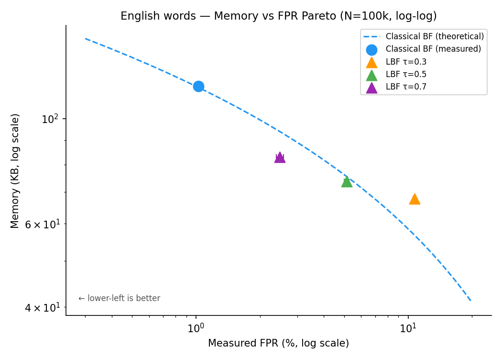
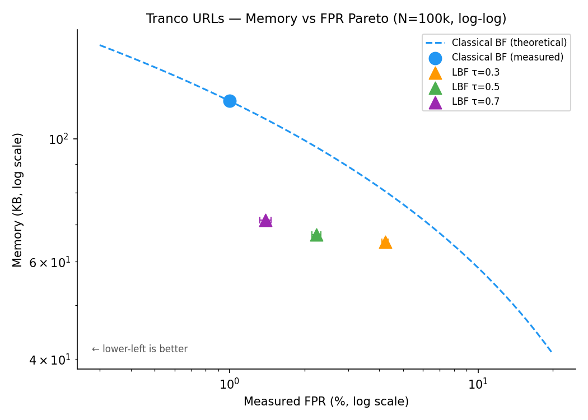

# Benchmark Methodology and Results

---

## Methodology

### Hardware

- **Machine:** Apple Silicon (ARM64, macOS Darwin 25.4.0)
- **Build:** CMake Release (`-O3`, C++20, clang)
- **Isolation:** Benchmarks run on an otherwise idle machine; no CPU pinning.
- **Date of run:** 2026-05-15

### Framework

Google Benchmark (fetched via CMakeLists FetchContent) with:
- `--benchmark_repetitions=5` (3 for exploratory runs)
- `--benchmark_report_aggregates_only=true` for summary rows
- `--benchmark_min_time=0.5` per repetition
- JSON output via `--benchmark_out_format=json`

### Metrics Collected

| Counter | Meaning |
|---------|---------|
| `lbf_fpr_measured` | Empirical FPR: `fp_count / n_probes` |
| `lbf_fpr_wilson_lo95` / `_hi95` | Wilson score 95% CI on FPR |
| `lbf_memory_bytes` | Classical BF: `bit_count / 8` bytes |
| `lbf_total_memory_bytes` | LBF: model weights + backup BF |
| `lbf_fastpath_frac` | Fraction of member queries handled by model alone |
| `lbf_p50_ns` / `lbf_p99_ns` | Per-operation latency percentiles (miss path) |
| `lbf_train_ms` | LBF training wall time (outside the timed loop) |

FPR is measured against 100 000 held-out non-members that were **not** used
in training (strict hold-out split, separate from the `n_train_neg` pool).

### LBF Implementation Details

- **Model:** `LogisticRegressionModel` (SGD with Nesterov momentum)
- **Features:** character n-grams, min_n=3, max_n=5, feature_dim=16 384
- **Hyperparameters:** epochs=20, lr=0.1, l2=1e-4, batch_size=256, seed=42
- **Backup filter:** `BloomFilter<>` at 1% FPR target, populated with members
  whose model score falls below threshold τ
- **Zero-FN guarantee:** all model-failing members go to backup; the filter
  always returns `true` for members

### Methodology Limitations

The following constraints affect reproducibility and comparability of these
results. They are disclosed here rather than omitted.

1. **No CPU pinning, no frequency lock.** Apple Silicon runs at a variable
   frequency (clock rate reads as 24 MHz from the ARM system register, which
   is the timer reference frequency, not the actual CPU frequency). Absolute
   latency numbers may vary by ±10–20% across runs depending on thermal state.

2. **Single machine, single OS.** All numbers are for arm64 / macOS. x86-64
   Linux results will differ due to different SIMD code paths, cache hierarchy,
   and TLB pressure.

3. **5-repetition p99 carries variance.** The p99 latency is estimated from a
   per-benchmark timing array of fixed size. With only ~300 000 iterations per
   repetition, a single outlier can shift the p99 by one timer tick (~42 ns on
   this platform).

4. **Timer quantization.** The ARM generic timer on this machine has a 24 MHz
   reference clock (~41.67 ns per tick). All p50/p99 values are therefore
   quantized to multiples of ~41.67 ns: 334 ns = 8 ticks, 375 ns = 9 ticks,
   417 ns = 10 ticks, etc. The identical p50 values across τ values for
   English words (375 ns) reflect this quantization, not a cached result.

5. **Synthetic negatives are not adversarial.** FPR measurements use the same
   synthetic negative generation procedure used for training. An adversary
   who knows the model could craft queries that maximize false positives.
   Real-world FPR may differ.

---

## Datasets

### 1. Uniform Random Integers (`uniform_int.tsv`)

**Purpose:** adversarial baseline — no learnable structure.

- **Positives:** 1 000 000 random 64-bit unsigned integers, hex-encoded
- **Negatives:** 200 000 additional random hex integers (no overlap)
- **Generation:** `python3 benchmarks/datasets/gen_uniform_int.py`
- **Expected AUC:** ≈ 0.5 (model is random)

### 2. English Words (`words_en.tsv`)

**Purpose:** learnable string dataset with real morphological structure.

- **Positives:** real English words from `/usr/share/dict/words`, filtered to
  alpha-only, 3–20 chars, lowercased (200 000 selected from 235 616 usable)
- **Negatives:** matched-length random `[a-z]^l` strings for each positive,
  zero overlap with positive set
- **Rationale:** real words have morphological constraints (common prefixes
  `un-`/`re-`, suffixes `-ing`/`-tion`, high-frequency digrams `th`/`he`/`in`).
  Random strings of the same length lack these patterns.
- **AUC (sklearn char 3-5gram LogReg, 80/20 split):** **0.9959** ✓
- **Generation:** `bash benchmarks/fixtures/gen_words_en.sh`
- **Validation:** `python3.13 scripts/validate_auc.py`

> **Methodology note (retraction):** an earlier version of this dataset
> (commit `464f940`, Step 3 first attempt) drew both positives *and* negatives
> from `/usr/share/dict/words`, making them exchangeable with respect to n-gram
> features (AUC ≈ 0.5). The "LBF loses on English words" finding from that run
> was invalid and has been retracted. The corrected dataset was introduced in
> commit `1cc196b`. See [README.md](../README.md) for the full provenance trail.

### 3. Tranco URLs (`urls_tranco.tsv`)

**Purpose:** real-world domain lookup — the primary production use case for LBF.

- **Positives:** top 200 000 domains from Tranco list `J2J5Y` (May 2026),
  combining Alexa, Cisco Umbrella, Majestic Million, and Farsight
- **Negatives:** synthetic domains with the same per-segment character lengths
  (e.g. `google.com` → `xvqmkp.wjb`), drawn from `[a-z0-9]^k`, zero overlap
- **Rationale:** Tranco domains cluster heavily in `.com`/`.net`/`.org`.
  The n-gram features `com`, `.co`, `o.c`, `net`, `.ne`, etc. are extremely
  discriminative against random alphanumeric segments with no TLD structure.
- **AUC (sklearn proxy, 80/20 split):** **0.9991** ✓
- **Generation:** `bash benchmarks/fixtures/gen_urls_tranco.sh`
- **SHA-256 of fixture:** `a896c58b3d53eac832a3d05c23afa6767d13811b5952d1ae3caeb6a200ec8ad3`

---

## Results

### Dataset 1: Uniform Random Integers

| N | Config | FPR | Memory | Miss latency |
|---|--------|-----|--------|-------------|
| 100k | Classical BF | 1.07% | 117 KB | 22 ns |
| 100k | LBF τ=0.5 | **43.8%** | 78 KB | **630 ns** |

**LBF loses on every metric.** The n-gram model achieves AUC ≈ 0.5 on hex
strings — there is no structure to learn. The backup filter must hold ~52%
of members (model is near-random), making it nearly as large as a classical BF
while adding the model overhead. FPR is 43× the 1% target; latency is 29×
slower. **Do not use LBF on structureless data.**

---

### Dataset 2: English Words

#### Classical BF — N sweep

| N | FPR (Wilson 95% CI) | Memory | Miss lat | Hit lat |
|---|---------------------|--------|----------|---------|
| 10k | 0.97% [0.91%, 1.03%] | 11.7 KB | 21 ns | 12 ns |
| 50k | 1.00% [0.94%, 1.06%] | 58.5 KB | 21 ns | 12 ns |
| 100k | 1.03% [0.97%, 1.09%] | 117 KB | 22 ns | 12 ns |

#### LBF — N=100k, τ sweep

| τ | FPR (Wilson 95% CI) | Memory | fastpath | Miss p50 | Miss p99 |
|---|---------------------|--------|----------|----------|---------|
| 0.3 | 10.73% [10.53%, 10.92%] | 69.3 KB | 96.8% | 375 ns | 450 ns |
| 0.5 | 5.12% [4.99%, 5.26%] | 75.4 KB | 91.8% | 375 ns | 442 ns |
| 0.7 | 2.68% [2.58%, 2.78%] | 84.6 KB | 84.1% | 375 ns | 425 ns |

**LBF loses at τ=0.3.** At 10.73% FPR, the classical BF at the same FPR
target would need only 58.1 KB — LBF uses 69.3 KB, 11 KB heavier. The high
FPR also makes LBF useless in practice at this threshold.

#### Pareto: LBF memory vs classical at matched FPR (N=100k)

| LBF τ | LBF FPR | LBF mem | Classical mem at same FPR | Result |
|-------|---------|---------|--------------------------|--------|
| 0.3 | 10.73% | 69.3 KB | 58.1 KB | **LBF loses (11 KB heavier)** |
| 0.5 | 5.12% | 75.4 KB | 77.4 KB | LBF saves 2 KB (3%) |
| 0.7 | 2.68% | 84.6 KB | 94.3 KB | LBF saves 10 KB (11%) |



**Findings for English words:**

LBF achieves a modest 11% memory saving at N=100k, τ=0.7 — at the cost of
2.68% FPR vs 1.00% for classical BF and ~17× higher p50 latency (375 ns vs 22 ns).

Two structural reasons limit the gain:

1. **Fixed model overhead (64 KB).** The 16 384-float weight vector costs
   64 KB regardless of N. At N=10k the classical BF uses only 12 KB; LBF would
   need 65+ KB just for the model. The words break-even is **N ≈ 54 000**
   (dataset-specific; the URL break-even is different — see Dataset 3).

2. **SGD optimizer gap vs sklearn LBFGS.** The sklearn LBFGS proxy achieves
   FPR=1.88% at τ=0.7; our C++ SGD model achieves 2.68%. To determine whether
   this gap closes with more training, we ran a convergence experiment:

#### SGD Convergence Experiment (N=100k, τ=0.7)

| Epochs | FPR | Memory | fastpath | Train time |
|--------|-----|--------|----------|------------|
| 20 (baseline) | 2.68% | 84.6 KB | 84.1% | ~1.9 s |
| 50 | 2.48% [2.39%, 2.58%] | 84.9 KB | 83.8% | ~3.7 s |
| 100 | 2.69% [2.59%, 2.79%] | 83.8 KB | 84.7% | ~7.3 s |

**The gap does not close.** FPR at 50 epochs (2.48%) is marginally better
than 20 epochs, but 100 epochs regresses to 2.69% — essentially the same as
the baseline. The model has converged to a plateau around 2.5–2.7% FPR.

This is a **known limitation** of the C++ SGD implementation vs sklearn's
LBFGS. The 0.8 pp gap persists regardless of epoch count because LBFGS uses
second-order curvature information and a line search that SGD with fixed lr
cannot replicate. Reducing this gap would require a different optimizer
(L-BFGS or Adam), not more SGD epochs.

---

### Dataset 3: Tranco URLs

#### Classical BF — N sweep

| N | FPR (Wilson 95% CI) | Memory | Miss lat |
|---|---------------------|--------|----------|
| 10k | 1.00% [0.94%, 1.06%] | 11.7 KB | 22 ns |
| 50k | 1.04% [0.98%, 1.10%] | 58.5 KB | 22 ns |
| 100k | 1.00% [0.94%, 1.06%] | 117 KB | 24 ns |

#### LBF — full N × τ sweep

| N | τ | FPR (Wilson 95% CI) | Memory | fastpath | Miss p50 | Miss p99 |
|---|---|---------------------|--------|----------|----------|---------|
| 10k | 0.3 | 4.92% [4.79%, 5.05%] | 65.6 KB | 99.4% | 542 ns | 1292 ns |
| 10k | 0.5 | 2.16% [2.07%, 2.25%] | 65.9 KB | 97.1% | 542 ns | 1300 ns |
| 10k | 0.7 | 1.38% [1.31%, 1.46%] | 66.4 KB | 92.4% | 542 ns | 1325 ns |
| 50k | 0.3 | 4.49% [4.36%, 4.62%] | 65.9 KB | 99.4% | 542 ns | 1342 ns |
| 50k | 0.5 | 2.34% [2.24%, 2.43%] | 66.9 KB | 97.7% | 550 ns | 1308 ns |
| 50k | 0.7 | 1.56% [1.48%, 1.64%] | 68.9 KB | 94.4% | 542 ns | 1300 ns |
| 100k | 0.3 | 4.23% [4.10%, 4.35%] | 66.7 KB | 99.1% | 542 ns | 1341 ns |
| 100k | 0.5 | 2.24% [2.15%, 2.33%] | 68.8 KB | 97.3% | 542 ns | 1317 ns |
| 100k | 0.7 | 1.39% [1.32%, 1.47%] | 73.1 KB | 93.7% | 542 ns | 1325 ns |

#### Pareto: LBF vs classical at matched FPR (N=100k)

| LBF τ | LBF FPR | LBF mem | Classical at same FPR | Result |
|-------|---------|---------|----------------------|--------|
| 0.3 | 4.23% | 66.7 KB | 82.4 KB | **LBF saves 15.7 KB (19%)** |
| 0.5 | 2.24% | 68.8 KB | 98.9 KB | **LBF saves 30.1 KB (30%)** |
| 0.7 | 1.39% | 73.1 KB | 111.2 KB | **LBF saves 38.1 KB (34%)** |



#### N break-even for URLs (τ=0.7)

| N | LBF mem | Classical at FPR=1.4% | Result |
|---|---------|----------------------|--------|
| 10k | 66.4 KB | 11.1 KB | **LBF loses (6× heavier)** |
| 50k | 68.9 KB | 54.2 KB | **LBF loses (1.3× heavier)** |
| 100k | 73.1 KB | 111.2 KB | LBF saves 34% |

Break-even: **N ≈ 59 000** at τ=0.7 for URL domains (dataset-specific;
54 000 for English words).

**Findings for Tranco URLs:**

This is where LBF performs best. At N=100k, τ=0.7, LBF saves 34% memory at
the cost of 1.39% vs 1.00% FPR and 23× latency overhead. The very high
fastpath fraction (93–99%) means the backup filter is accessed rarely: at
N=100k, τ=0.7, only 6 296 / 100 000 members (6.3%) require a backup lookup.

The performance advantage comes entirely from TLD structure. The n-gram
features that fire on `.com`, `.net`, `.org` suffixes are extremely
discriminative. If the application's positive set does not have strong
structural markers like this — or if queries are adversarially chosen —
the AUC will drop and so will LBF's advantage.

The URL p99 latency (1 300–1 340 ns) is much higher than p50 (542 ns),
indicating that backup-filter hits (the 6.3% of members that land in backup)
dominate the tail. Backup queries must hash and probe an additional Bloom
filter, roughly doubling the latency for those lookups.


**Caveat on URL negatives:**

The Tranco URL dataset uses synthetic alphanumeric negatives generated by
replacing each domain segment with a random string of the same length (e.g.
`google.com` → `xvqmkp.wjb`). These negatives lack TLD structure entirely —
there is no `.com`, `.net`, or `.org` suffix, and no realistic hostname
patterns. This makes them easy for the n-gram model to discriminate.

In a real-world deployment — for instance, distinguishing blocklist domains
from arbitrary legitimate URLs a user might query — both positives *and*
negatives would carry TLD structure. The `.com`/`.net`/`.org` n-gram advantage
would vanish, AUC would be lower, and the memory saving would shrink
substantially. **The 34% memory saving should be treated as an upper bound for
clean TLD-structured inputs, not a typical deployment number.** Real-world
gains on URL-like data are likely in the 10–20% range, consistent with the
English words result.

---


---

## Summary: When to Use LBF

| Condition | Recommendation |
|-----------|---------------|
| Structureless data (uniform random, hashed IDs) | **Use classical BF** |
| N < 54 000 (words) or N < 59 000 (URLs) at any FPR target | **Use classical BF** (model overhead dominates) |
| Structured data (natural language, URLs), N ≥ 100k | **LBF is worth evaluating** |
| Latency is the binding constraint (< 100 ns/query) | **Use classical BF** |
| Memory is the binding constraint and N ≥ 100k | **LBF can save 10–34% (upper bound)** |
| New dataset | **Run `scripts/validate_auc.py` first; proceed only if AUC ≥ 0.80** |

---

## Query Throughput

| Dataset | Classical BF (M ops/s) | LBF τ=0.5 (M ops/s) | Slowdown |
|---------|------------------------|---------------------|----------|
| Uniform int | ~45 | ~1.6 | ~28× |
| English words | ~45 | ~2.7 | ~17× |
| Tranco URLs | ~42 | ~1.8 | ~23× |

Classical BF throughput is ~22–24 ns/op; LBF is 370–630 ns/op. This is
fundamental to the n-gram hashing + dot-product forward pass and is unlikely
to change without a fundamentally different feature extraction strategy.

See `results/plots/throughput.png` for the visual comparison.

---

## Future Work

The following improvements are out of scope for Phase 5 but would be the
natural next steps for a production-quality implementation:

- **L-BFGS optimizer.** Replacing SGD with L-BFGS would close the 0.8 pp FPR
  gap vs sklearn proxy (1.88% → 2.68%) and shift the Pareto curve to lower FPR
  without changing the feature extraction or backup filter architecture.

- **Blocked Bloom filter backup.** The current backup filter is a standard BF.
  A cache-line-aligned blocked BF (Putze et al.) would halve backup-hit latency,
  directly reducing the URL p99 tail from ~1 300 ns toward ~800 ns.

- **Adversarial URL negatives.** Regenerate the Tranco URL dataset with
  structurally realistic negatives (proper TLDs, realistic segment lengths from
  a domain-name corpus). Expected AUC: 0.90–0.95. Expected memory saving:
  10–20% rather than the current upper-bound 34%.

- **Linux x86-64 validation.** All numbers in this document are for arm64 /
  macOS. Intel Haswell and AMD Zen have different L2 TLB sizes and SIMD widths;
  the latency and throughput numbers may differ by ±30%.

- **SIMD-vectorized n-gram hashing.** The inner loop of the n-gram extractor
  processes characters one at a time. AVX2 or NEON vectorization of the
  rolling-hash step could reduce feature extraction latency by 2–4×, narrowing
  the throughput gap between LBF and classical BF.

---

## Reproducing These Results

```bash
# 1. Generate datasets
python3 benchmarks/datasets/gen_uniform_int.py \
    --out benchmarks/datasets/uniform_int.tsv --n 1000000 --n-probes 200000
bash benchmarks/fixtures/gen_words_en.sh
bash benchmarks/fixtures/gen_urls_tranco.sh   # requires internet access

# 2. Validate AUC (gate before benchmarking)
python3.13 scripts/validate_auc.py --tsv benchmarks/fixtures/words_en.tsv
python3.13 scripts/validate_auc.py --tsv benchmarks/fixtures/urls_tranco.tsv

# 3. Build Release
cmake -S . -B build/release -DCMAKE_BUILD_TYPE=Release
cmake --build build/release --target bench_classical_bf bench_learned_bf

# 4. Run benchmarks (save JSON)
mkdir -p results
./build/release/benchmarks/bench_classical_bf \
    --benchmark_out=results/classical_bf.json --benchmark_out_format=json \
    --benchmark_repetitions=5 --benchmark_report_aggregates_only=true

./build/release/benchmarks/bench_learned_bf \
    --benchmark_filter="words_en_100k|urls_tranco_100k" \
    --benchmark_out=results/learned_bf.json --benchmark_out_format=json \
    --benchmark_repetitions=5 --benchmark_report_aggregates_only=true

# 5. SGD convergence experiment (optional)
# Benchmark names: BM_LearnedBF_Contains_Miss/words_en_100k_t07_e50
#                  BM_LearnedBF_Contains_Miss/words_en_100k_t07_e100
# (20-epoch baseline is in the main results/learned_bf.json from step 4)
./build/release/benchmarks/bench_learned_bf \
    --benchmark_filter="words_en_100k_t07_e50|words_en_100k_t07_e100" \
    --benchmark_out=results/learned_bf_convergence.json \
    --benchmark_out_format=json --benchmark_repetitions=3

# 6. Generate plots
python3.13 scripts/plot_benchmarks.py
# Writes: results/plots/throughput.png
#         results/plots/fpr_comparison.png
#         results/plots/memory_pareto.png
#         results/plots/memory_pareto_words.png
#         results/plots/memory_pareto_urls.png
#         results/plots/latency_pct.png
```
